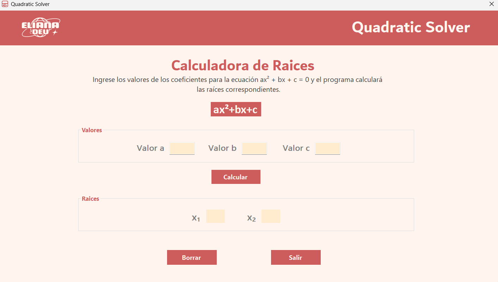
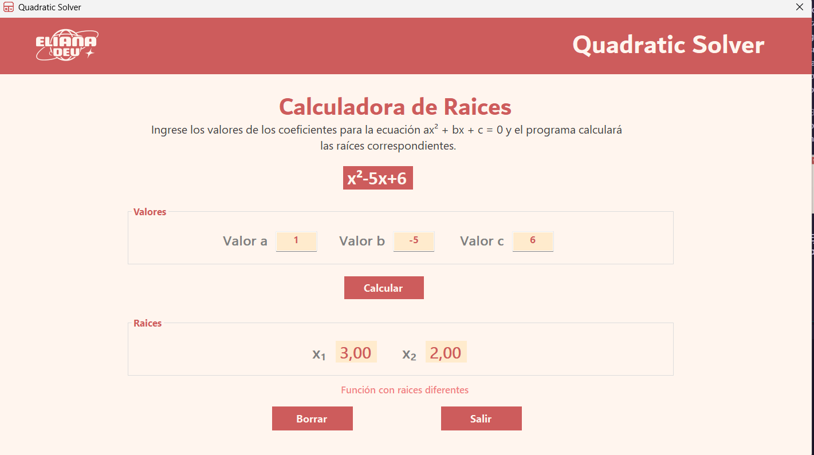
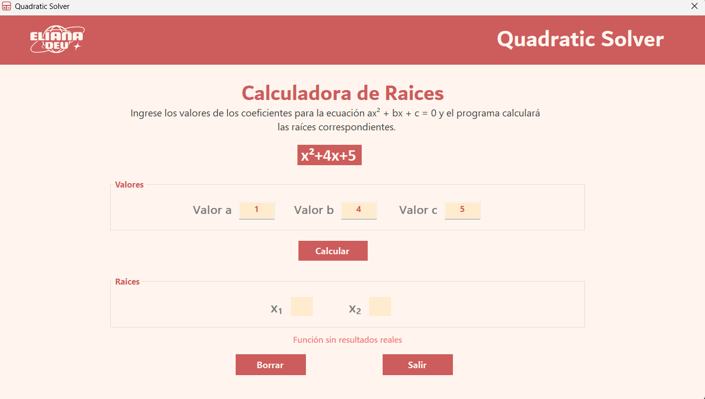

# quadratic-solver

Es un programa que permite el ingreso de funciones de segundo grado y calcula sus raíces utilizando la fórmula de Bhaskara.

## ✨ Caracteristicas Principales

- Calculo de raices de funciones polinomicas de segundo grado en la forma `ax²+bx+c`
- Indica si las raíces son:
  - Dos reales distintas
  - Reales e iguales (repetidas)
  - No reales (imaginarias)
- Interfaz gráfica sencilla y amigable.

## 🚀 Uso

Esta es la pantalla principal. En la parte superior, debajo del título, puedes ver la fórmula general de una función cuadrática en forma polinómica. Esta se actualizará según los valores ingresados en los campos.

- **Valor A**: Aquí se ingresa el coeficiente del término cuadrático.

- **Valor B**: Aquí se ingresa el coeficiente del término lineal.

- Valor C: Aquí se ingresa el valor de la ordenada al origen (intersección con el eje y).

Una vez que hayas ingresado cada valor en su campo correspondiente, presiona el botón con la etiqueta `"Calcular"`, y el programa mostrará el resultado en la parte inferior.

**El resultado variará según los valores ingresados;** puedes obtener raíces dobles, raíces distintas o que no existan raíces reales. El programa indicará cada caso en consecuencia.

En la parte inferior, hay dos botones:

El botón `"Limpiar"` borra todas las entradas en los campos, la función generada en la parte superior y los resultados en la parte inferior. Es útil cuando quieres recalcular otras raíces.

El botón `"Salir"` cierra el programa. Es útil cuando has terminado tus cálculos.

## 📘 Ejemplo de uso: posibles resultados

### Caso 1: Raices diferentes

Los valores ingresados por el usuario resulto en una función con raices diferentes.

### Caso 2: Raices iguales

Los valores ingresados por el usuario resulto en una función con raices duplicadas.

### Caso 3: Sin raices reales

Los valores ingresados por el usuario resulto en una función sin raices (sin resultados reales).

## 📂 Tecnologias utilizadas

